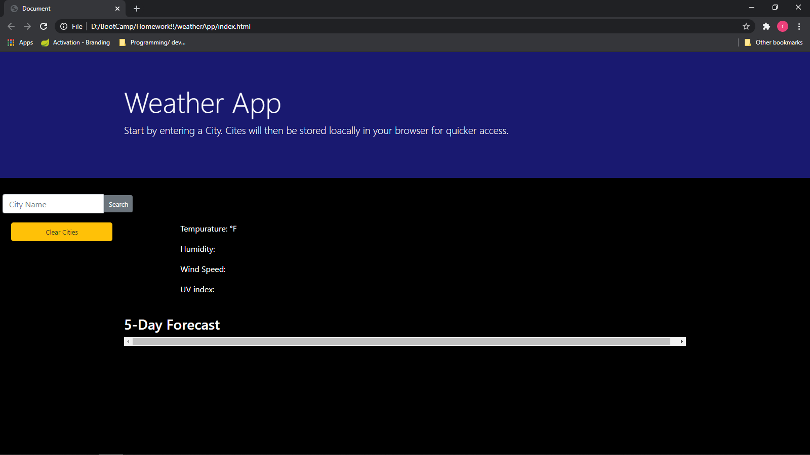
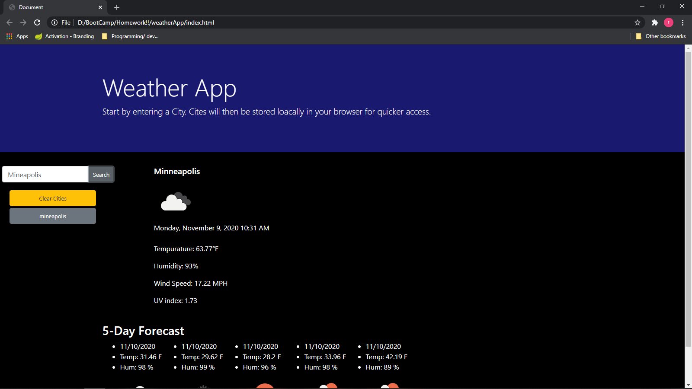
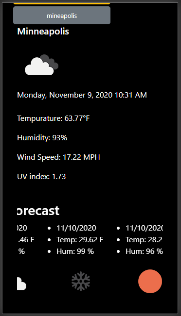

# weatherApp

## *Objective* 
To make a weather forecast application

### Method
using open waether api and moment library this application will search out a city of your chosing and siplay the current and 5 day forcast for you. it will also save 
searched cities in local storage for easy access. Those stored cities will be displayed on the page as buttons.

 
 
 

### Usage 
plan your day or week with the weather in mind.

### Instalation
To make the project work you will need -
* an editor or ide that will save file in the proper types*(html,css,javascript)*  
`Visual Studio or Visual Studio Code` will work great.
* using a version control system you can fork and clone my repo, you could also 
just download the files directly for git hub.

### Deployed website and screenshots

[Link](https://rickycohen88.github.io/weatherApp/)

### Credits
* Trillogy Education
* open weather Api
* moment.js
### Contributing
Pull requests are welcome. For major changes, 
please open an issue first to discuss what you would like to change. 
 Please make sure to update tests as appropriate.

### License
    Moment.js is freely distributable under the terms of the MIT license.
    © 2012 — 2020 OpenWeather ® All rights reserved.(Creative Commons Attribution-ShareAlike 4.0 International licence (CC BY-SA 4.0).)
    © 2020 Trilogy Education Services, a 2U, Inc. brand. All Rights Reserved.

   